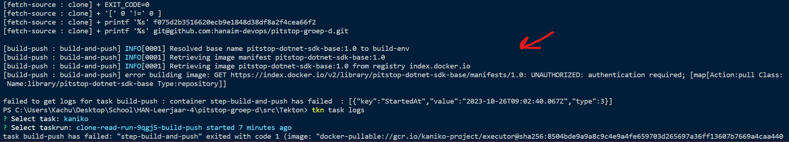

# Eigen bijdrage Kachung Li

Voor het Pitstop beroepsproduct heb ik voornamelijk gewerkt aan het opzetten van een build & deploy pipeline d.m.v. Github Actions en het opzetten van de Github Container Registry zodat onze pipeline gebruik van de images kan maken. Ook heb ik het initiële opzet gedaan van de .NET Core API door de eerste controller, model en EFCore op te zetten. Dan heb ik de API geintegreerd met Docker & Docker compose en de API daarna overgedragen. Vervolgens heb ik de front-end van het toevoegen van loyaliteitspunten in het loyaliteitssysteem geïmplementeerd met onze API. Ook had ik een poging gedaan om Tekton toe te passen binnen het beroepsproduct, maar dat is helaas niet gelukt.

## 1. Code/platform bijdrage

- [Back-end loyaliteitssysteem opzetten en toegevoegd aan Docker compose van Pitstop](https://github.com/hanaim-devops/pitstop-groep-d/issues/6)
- [Initiële opzet van loyaliteitsAPI met eerste model en controller en opzet EFCore](https://github.com/hanaim-devops/pitstop-groep-d/commit/7f89efec6c880baf0b422d4da6d7d486fc5d986f)
- [Toevoegen van loyaliteitspunten aan een klant in het loyaliteitssysteem na een onderhoudsbeurt](https://github.com/hanaim-devops/pitstop-groep-d/commit/09784094d0778c4dd9efcf037f0eb3800ff60a95)
- [Aanpassen van het loyaliteitsoverzicht zodat het de klantnaam weergeeft i.p.v. de klantid, en aflopend sorteren van loyaliteitspunten](https://github.com/hanaim-devops/pitstop-groep-d/commit/9dcc8d7697fc043394eaec197dedb973f317e431). Belangrijkste hierbij is het gebruik van een bovenliggende Viewmodel dat de viewmodels van Customers en Loyalty gebruikt.

## 2. Bijdrage app configuratie/containers/kubernetes

- [Dockerfile aangemaakt zodat het API van het loyaliteitssyseem op een Docker container kan draaien](https://github.com/hanaim-devops/pitstop-groep-d/blob/main/src/LoyaltySystemAPI/Dockerfile)
- [Toevoegen van het loyaliteitssysteem aan Docker compose zodat het samen met de andere Pitstop containers draait](https://github.com/hanaim-devops/pitstop-groep-d/commit/56685a7be8d0c2f21a9060435c8774e5a55801ed)
- [Configuratie van de API van het loyaliteitssysteem zodat het met docker compose werkt](https://github.com/hanaim-devops/pitstop-groep-d/commit/582a026231a8409d1e5eefd606f223c8bc6143b9)

## 3. Bijdrage versiebeheer, CI/CD pipeline en/of monitoring

- Met [Github Actions](https://github.com/hanaim-devops/pitstop-groep-d/commits/main/.github/workflows/docker-image.yml) pipelines opzetten om het builden en pushen van image naar Github Registry te automatiseren
- [Opzet van Github Registry voor updaten image](https://github.com/orgs/hanaim-devops/packages/container/package/loyaltysystemapi). Het lukte me niet om via de Docker registry te authenticeren met Tekton. Door een voorstel van een domeinexpert heb ik de Docker image naar Github Container registry verhuisd. Daarna lukte het nog steeds niet om met Tekton te authenticeren zodat de image op de registry komt.

## 4. Onderzoek

Voor mijn onderzoek heb ik [Tekton](https://github.com/hanaim-devops/blog-kachung-tekton) onderzocht. Tekton is een manier om CI/CD pipelines te implementeren dat binnen elke Kubernetes Cluster kan draaien. Mijn idee was om op de k8s cluster van Pitstop een pipeline te draaien die alle bestanden vanuit Git ophaalt, en een Docker image bouwt als er een push op main gebeurt. In principe hetzelfde idee als hoe dit op een standaard pipeline van Github Actions of Gitlab CI/CD gebeurt.

Voor mijn blog heb ik alleen de Git repository van Pitstop via HTTPS opgehaald, vooral omdat ik het instellen van de SSH sleutel niet werkend kreeg. Ik dacht de heletijd dat ik de SSH sleutel verkeerd had ingesteld als mijn [Kubernetes secret](https://github.com/hanaim-devops/pitstop-groep-d/blob/main/src/Tekton/secret.yaml.example). Toch blijkt het dat de [git-clone v0.9](https://github.com/tektoncd/pipeline/issues/5611#issuecomment-1272380288) task van de Tekton Hub niet werkt op een bepaalde versie. Dit probleem heeft mij veel tijd gekost om dat uit te zoeken. Uiteindelijk heb ik wel via SSH authenticatie de Pitstop repository van onze groep kunnen pullen. De kennis bij het instellen van de Secrets hoopte ik mee te kunnen nemen naar mijn volgende taak.

Daarna heb ik geprobeerd om de pipeline een Docker image te bouwen en deze naar de registry te laten pushen. Het bouwen verloopt gewoon prima, maar het lukte uiteindelijk niet om de image naar de registry te pushen. Uiteindelijk kwam het erop neer dat ik geen rechten had in de pipeline om images van Pitstop te pullen vanuit de Docker Registry.

Ik heb ook nog geprobeerd om de pipeline in Github Actions erin te bouwen, maar daar kwam ik dezelfde foutmelding tegen als hierboven. Het lukte mij niet om dit probleem op te lossen.

Ik had dit bij mijn groep neergelegd, en ik heb daarna de advies gekregen om alle Docker images te builden en te pushen op de [Github Container Registry](https://docs.github.com/en/packages/working-with-a-github-packages-registry/working-with-the-container-registry). Zo is het niet nodig om alle images in een publieke repo neer te zetten.

## 5. Bijdrage code review/kwaliteit anderen en security

Competenties: *DevOps-7 - Attitude*, *DevOps-4 DevSecOps*

- [Review gegeven op C4 diagram voor loyaliteitsprogramma wegens kennis van API door het opzetten](https://github.com/hanaim-devops/pitstop-groep-d/pull/34)
- [Voorstel om documentatie gewoon direct op de main te committen](https://github.com/hanaim-devops/pitstop-groep-d/pull/54)

## 6. Bijdrage documentatie

Competenties: *DevOps-6 Onderzoek*

- [Review gegeven op C4 diagram voor loyaliteitsprogramma](https://github.com/hanaim-devops/pitstop-groep-d/pull/34)
- [ADR Tekton om aan te geven waarom implementatie niet lukte. Alternatief voorgesteld en geimplementeerd](https://github.com/hanaim-devops/pitstop-groep-d/blob/main/adr/kubernetes-pipelines-tekton.md)
- [Het inloggen op GHCR zodat teamleden de docker images op kunnen halen](https://github.com/hanaim-devops/pitstop-groep-d/commit/a73f1b2c37bc960950a7879329031fdb5b49c91f)

## 7. Bijdrage Agile werken, groepsproces en communicatie opdrachtgever en soft skills

Competenties: *DevOps-1 - Continuous Delivery*, *Agile*

- Werkproces in scrum gedaan.
  - Elke dag een daily standup gedaan, na de lunch een statusupdate en op het einde van de dag nog een daily standdown via teams.
- GHCR geimplementeerd en onderzocht i.p.v. Docker Registry na suggestie van domeinexpert zodat packages en images niet publiek openstaan.
- Poging gedaan om het team te sturen om op de main branch te werken.
  - Tegenargumentatie: Code reviews niet mogelijk meer hierdoor. Uiteindelijk niet gedaan.
- Aanmaken van issues om overzicht te krijgen wat voor taken er moeten gebeuren.
  
## 8. Leerervaringen

Competenties: *DevOps-7 - Attitude*

Ik ben blij met de bijdrage en overdracht van de back-end API. Het heeft me veel tijd gekost om de back-end in elkaar te zetten, voornamelijk de configuratie van de API en de integratie met Pitstop. Hiervoor moest ik vaak een stuk langer doorwerken om dat voor elkaar te krijgen, waardoor de API uiteindelijk werkt. We hadden nog de gedachte om geen database te gebruiken omdat de connectie via EFCore gewoon niet goed ging. Ik heb veel doorgezet om het probleem uiteindelijk op te lossen.

Dit is echter ook een valkuil tegelijk, want ik ben erg lang bezig geweest om Tekton CI/CD te integreren, maar het authenticeren binnen Tekton is mij uiteindelijk niet gelukt. Ik ben hier waarschijnlijk het meeste tijd kwijt voor geen resultaat, en ik heb hiervoor ook geen hulp gevraagd. Hiervoor had ik beter een domeinexpert kunnen vragen waarom het steeds niet lukte.

Tops:
  - Bijdrage aan project over algemeen, vooral aan het toevoegen van loyaliteiteitspunten in de front-end
  - Uitleggen van werking van een feature binnen de applicatie aan een teamlid ging over het algemeen goed. Ik zat een tijdje vast om een feature van het systeem te implementeren. Dit probleem had ik aan een teamlid uit kunnen leggen die geen idee had hoe de code eruit zag. Samen met hem heb ik een oplossing kunnen vinden om de feature afgerond te krijgen.

Tips:
  - Sneller vragen stellen aan domeinexpert als niemand in het groep weet.
  - Weten wanneer ik de knoop door moet hakken omdat het bijvoorbeeld niet lukt om een implementatie werkend te krijgen.
  - We hebben beter naar de beoordelingscriteria moeten kijken vanaf het begin, vooral het CDMM.

## 9. Conclusie & feedback

Dit is de tweede keer dat we Pitstop doen. De eerste keer waren de meesten van ons inclusief mezelf te lang bezig om onderzoek op hun eigen technologie te doen, waardoor er weinig tijd was om aan het beroepsproduct zelf te werken. Dit keer ging het werken een stuk beter, omdat iedereen een beter idee had wat er moest gebeuren. Ik heb dit liever gezien toen we de eerste keer aan het beroepsproduct werkten, maar toen was alles nog vaag bij het begin. Het belangrijkste wat ik hiervan meeneem is dat we onze taken wat strakker moeten plannen en beter met elkaar moeten communiceren. Ik was bijvoorbeeld een paar dagen met mijn onderzoek bezig, waardoor ik gewoon niet meer aan de belangrijkere taken konden werken, zoals de daadwerkelijke applicatie. Ik had tijdig aan moeten geven dat het niet lukte, maar soms kwam ik gewoon een kleine stap verder na een paar uur. Dit is echter niet genoeg vaart in een beroepsproduct wat maar 2 weken duurde.
