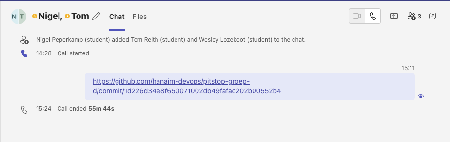

# Eigen bijdrage Wesley
 
## 1. Code/platform bijdrage

Voor code heb ik gewerkt aan het toevoegen van [loyaliteitspunten aan klanten](https://github.com/hanaim-devops/pitstop-groep-d/pull/56). Hierbij heb ik samen met Kachung hieraan gewerkt. De reden dat hier samen aan is gewerkt was, omdat hij er op dat moment niet uitkwam en iemand nodig had om er ook naar te kijken. Aangezien ik op dat moment geen taak had heb ik ervoor gekozen om hierbij te helpen. [Link naar commit waarbij er te zien is dat ik heb geholpen.](https://github.com/hanaim-devops/pitstop-groep-d/pull/56/commits/2e71ddc20ca65eac6f24508538096254fd5eef2e)
 
## 2. Bijdrage app configuratie/containers/kubernetes

Ik heb in bij de eerste kans gewerkt aan het opzetten van de [Ingress](https://github.com/hanaim-devops/pitstop-groep-d/commit/206bd39483d24213f56f7b9194e1dff6a86fc3c9). Door te kort aan tijd en het niet snappen van hoe de cluster en Rancher werkte, is dit uiteindelijk niet afgekomen.

Met de herkansing heb ik hier samen met Nigel naar gekeken. Hierbij heb ik mijn kennis die ik er over had aan hem verteld zodat hij er al een klein beetje van snapte voordat hij moest beginnen. Ik heb een paar keer met hem in een call gezeten na de DSU om hiermee bezig te zijn. Uiteindelijk doordat de cluster perongeluk was gedrained is het niet afgekomen.
n
## 3. Bijdrage versiebeheer, CI/CD pipeline en/of monitoring

Ik heb meegeholpen met het opzetten van de monitoring doormiddel van Grafana en Prometheus. Dit heb ik samen met Tom en Nigel gedaan door samen te werken in een Teams call. Hierbij gaf ik aan wat we het beste konden laten zien en hielp ik met het uitwerken ervan.

[GitHub Issue](https://github.com/hanaim-devops/pitstop-groep-d/issues/28)
## 4. Onderzoek

Tijdens de Course heb ik onderzoek gedaan naar K8S secrets via een externe provider. Het was de bedoeling om dit uiteindelijk te implementeren in de pitstop applicatie. Dit is uiteindelijk niet gelukt, dit kwam door tijd te kort en het lopen tegen errors waar ik niet uitkwam. Voor meer informatie zie 'k8s-secrets-extern.md', in deze ADR wordt er hier dieper op ingegaan.
 
## 5. Bijdrage code review/kwaliteit anderen en security
 
 Ik heb een poging gedaan om K8S secrets te implementeren via een externe provider. Als dit zou zijn gelukt was de security van de applicatie hierop vooruit gegaan. Dit komt doordat de secrets dan niet meer in de repo zelf zouden worden opgeslagen. Echter is dit helaas niet gelukt. 
 * [GitHub Issue](https://github.com/hanaim-devops/pitstop-groep-d/issues/12)

 Doordat ik vaak met mensen samen heb gewerkt, heb ik in de teams call al feedback kunnen geven. 
 * [feedback op PR](https://github.com/hanaim-devops/pitstop-groep-d/pull/34)
 * [feedback op PR](https://github.com/hanaim-devops/pitstop-groep-d/pull/31)
## 6. Bijdrage documentatie

Ik heb een ADR geschreven voor de [K8S secrets.](https://github.com/hanaim-devops/pitstop-groep-d/commit/c3cd4d1d19158454df928c5e4faeaec3d1f954cb) Het was mijn taak om hier een implementatie van uit te werken. Hier heb ik een poging aan gewaagd, maar is mij uiteindelijk niet gelukt.

Ook heb ik de userstories gemaakt, [GitHub Issue](https://github.com/hanaim-devops/pitstop-groep-d/issues/16)
 
## 7. Bijdrage Agile werken, groepsproces, communicatie opdrachtgever en soft skills

Tijdens dit BP gewerkt met SCRUM. Iedere dag een standup gedaan en standdown. Ook werd er in de middag nog een update gedaan via teams. Tijdens deze gesprekke was ik de scrummaster en dus ook de leider van de gesprekken. Hierbij heb ik ervoor gezorgd dat iedereen zijn verhaal kon doen. Hierdoor werden eventuele opstakels snel gedeeld met het team en kon er eventueel iemand bij springen als een teamlid er even niet uitkwam.
  
## 8. Leerervaringen

Tijdens dit BP ben ik voor het eerst echt gaan werken met C#. Dit heb ik in de opleiding of vrije tijd nog nooit gebruikt. Ik ben blij dat ik hiermee nu een beetje ervaring heb op gedaan. Echter kostte dit in het begin wel extra tijd, omdat ik de syntax moest begrijpen.

Ook kan ik de ervaring met K8S meenemen naar de toekomst.

Tops:
- Het sturen van het project als scrummaster tijdens de meetings en in kaart brengen wat er nog moet worden gedaan.
- Het gebruik maken van pair programming mocht ik of iemand anders ergens niet uitkomen.

Tips:
- Eerder aangeven als ik ergens niet uitkom.
- Beter kijken naar beoordelingsmodel en hierop inspelen. In plaats van alleen kijken welke features er nog moeten worden gemaakt.

## 9. Conclusie & feedback

Door dit project heb ik ervaring gedaan met dotnet, C# en K8S. Ik denk dat ik door deze basis hier wel voordeel uit ga halen mocht ik hier later nog mee moeten gaan werken. Echter was ik persoonlijk wel te lang bezig met het uitwerken van mijn onderzoek in dit project waardoor ik de eerste keer te weinig tijd had om ergens anders aan te werken.

Het uitbreiden van een bestaande applicatie die niet bepaald eenvoudig in elkaar zit was wel lastig. In het begin ben ik (en mijn team) veel tijd kwijt geweest aan het snappen hoe de PitStop applicatie in elkaar zit. Dit is eigenlijk verloren tijd voor het daadwerkelijk implementeren van onze eigen feature. Een idee is om tijdens de lessen al meer te werken met deze applicatie waardoor aan het begin van de opdracht het al helder is hoe deze in elkaar zit.

Uiteindelijk ben ik wel tevreden met het resultaat van het project en vind ik dat wij als team een prima product hebben opgezet.
