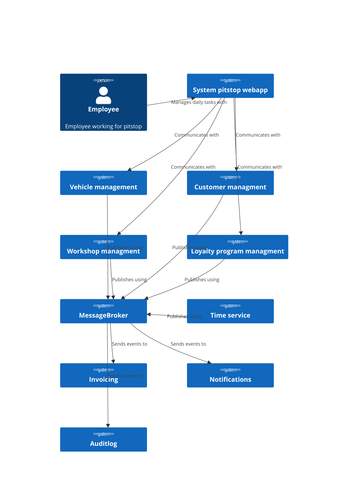
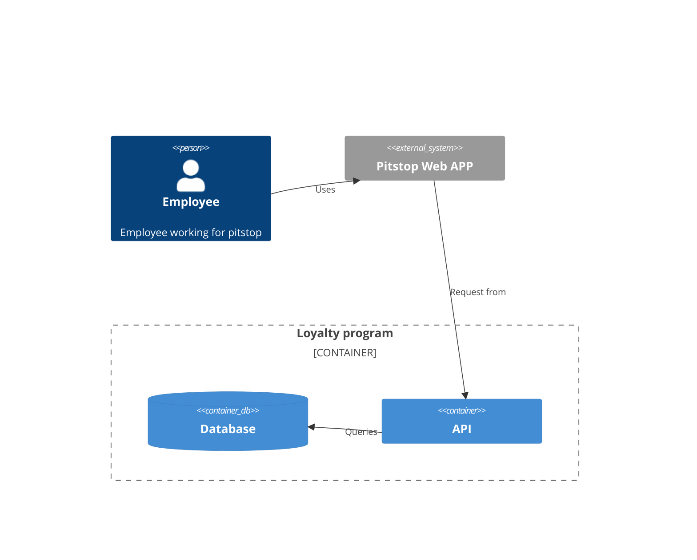
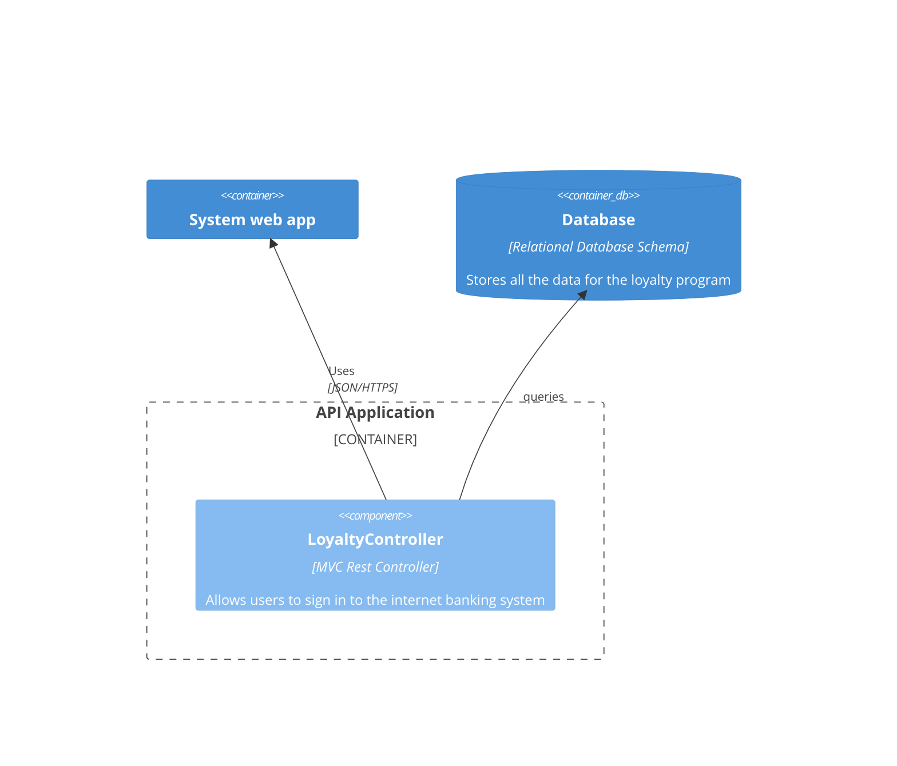

# Pitstop Groep D

## Opdracht

**Loyaliteitsprogramma:**
Een loyaliteitsprogramma introduceren waar klanten punten verdienen voor elke service of reparatie. Deze punten kunnen worden ingewisseld voor kortingen op toekomstige diensten, wat de klantenbinding versterkt.

Puntensysteem:

```text
Puntensysteem voor Klantloyaliteitsprogramma:

Uitgegeven Bedrag:

Voor elke 30 minuten dat de job duurt krijgt de customer 25 punten.
Niveaus en Beloningen:

- Zilverniveau (0-500 punten):
  - 500 punten: 10% korting op de volgende servicebeurt.
  - 1000 punten: Gratis olieverversing.
- Goudniveau (501-1000 punten):
  - 1000 punten: 15% korting op de volgende servicebeurt.
  - 1500 punten: Gratis APK-keuring.
- Platinaniveau (1001+ punten):
  - 2000 punten: 20% korting op de volgende servicebeurt.
  - 2500 punten: Gratis kleine reparatie (tot een bepaald bedrag).
- Speciale Acties:
  - Verdien dubbele punten tijdens speciale actieperiodes (bijvoorbeeld: feestdagen, jubileumvieringen).
- Vriendenverwijzingsbonus:
  - Verdien 100 extra punten voor elke nieuwe klant die wordt doorverwezen naar het loyaliteitsprogramma.
- Verjaardagsbeloning:
  - Ontvang 50 punten als geschenk op je verjaardag.
- Inwisselen van Punten:
  - Klanten kunnen hun punten inwisselen bij de volgende servicebeurt of reparatie.
```

## Onderzochte technologieën

- Wijnand: DevSecOps Container Scanning
- Kachung: Tekton CI/CD
- Wesley: Kubernetes secrets management via externe provider
- Cüneyt: Draft
- Nigel: Prometheus en Slack integratie
- Tom: InfluxDB

## C4 diagrams

### System context diagram


### Legenda
Pitstop Webapp System: The web application is the front-end for the system. Users can manage customers, vehicles and the planning for the workshop from this front-end. 
Vehicle Management: This service offers an API that is used to manage Vehicles in the system.
Customer Management: This service offers an API that is used to manage Customers in the system.
Workshop Management: This service contains 2 parts: an API for managing the workshop planning and an event-handler that handles events and builds a read-model that is used by the API.
Loyalty Program Management: This service handles rewards customers receive for their service and repairs.
Message Broker: Handles messages between services.
Time Service: Service that informs other services when a certain time-period has passed. 
Invoicing: Creates an invoice for all maintenance jobs that have been finished (and are not yet invoiced). 
Notifications: The notification service sends a notification to every customer that has a maintenance job planned on the current day.
Auditlog: Picks up all events from the message-broker and stores them for later reference.

### Container diagram

#### Loyalty program diagram



### Component diagram

#### Loyalty program diagram


