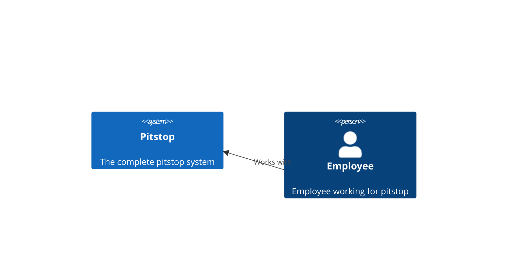
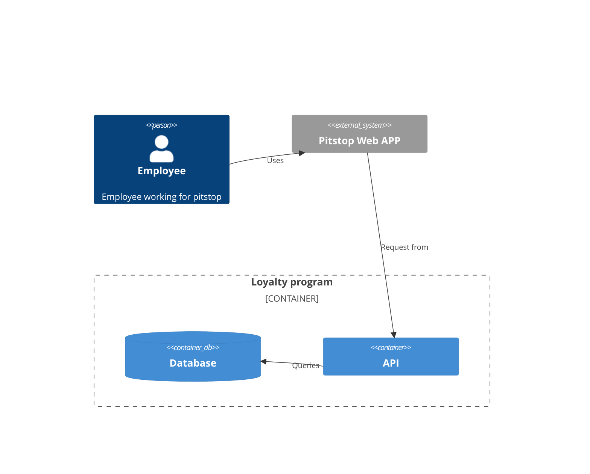
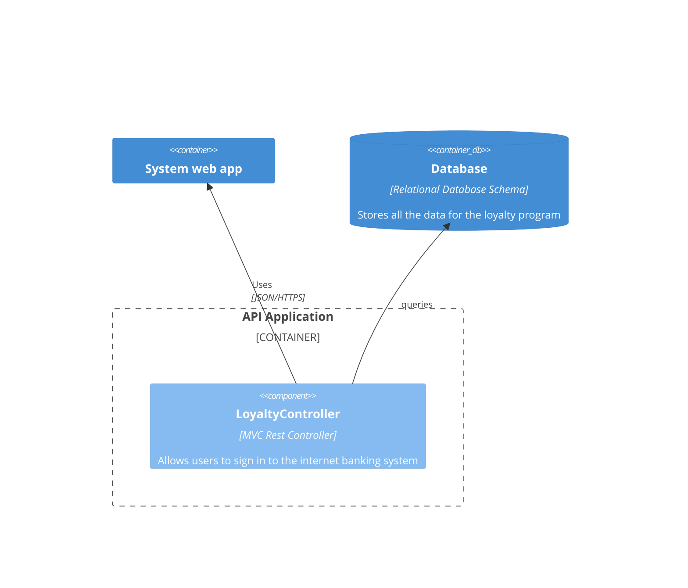

# Pitstop Groep D

## Opdracht

**Loyaliteitsprogramma:**
Een loyaliteitsprogramma introduceren waar klanten punten verdienen voor elke service of reparatie. Deze punten kunnen worden ingewisseld voor kortingen op toekomstige diensten, wat de klantenbinding versterkt.

Puntensysteem:

```text
Puntensysteem voor Klantloyaliteitsprogramma:

Uitgegeven Bedrag:

Voor elke 30 minuten dat de job duurt krijgt de customer 25 punten.
Niveaus en Beloningen:

- Zilverniveau (0-500 punten):
  - 500 punten: 10% korting op de volgende servicebeurt.
  - 1000 punten: Gratis olieverversing.
- Goudniveau (501-1000 punten):
  - 1000 punten: 15% korting op de volgende servicebeurt.
  - 1500 punten: Gratis APK-keuring.
- Platinaniveau (1001+ punten):
  - 2000 punten: 20% korting op de volgende servicebeurt.
  - 2500 punten: Gratis kleine reparatie (tot een bepaald bedrag).
- Speciale Acties:
  - Verdien dubbele punten tijdens speciale actieperiodes (bijvoorbeeld: feestdagen, jubileumvieringen).
- Vriendenverwijzingsbonus:
  - Verdien 100 extra punten voor elke nieuwe klant die wordt doorverwezen naar het loyaliteitsprogramma.
- Verjaardagsbeloning:
  - Ontvang 50 punten als geschenk op je verjaardag.
- Inwisselen van Punten:
  - Klanten kunnen hun punten inwisselen bij de volgende servicebeurt of reparatie.
```

## Onderzochte technologieën

- Wijnand: DevSecOps Container Scanning
- Kachung: Tekton CI/CD
- Wesley: Kubernetes secrets management via externe provider
- Cüneyt: Draft
- Nigel: Prometheus en Slack integratie
- Tom: InfluxDB

## Ophalen van Docker images

Alle Docker images staan nu op de Github Container Registry, voornamelijk zodat de pipeline de rechten heeft om de base images van Asp.net van Pitstop te pullen.

Om als developer zelf de images te builden via Docker compose, is het nodig om een [Github Personal Access Token](https://docs.github.com/en/packages/working-with-a-github-packages-registry/working-with-the-container-registry#authenticating-with-a-personal-access-token-classic) aan te maken met een account dat met het HANAIM-DevOps groep is gekoppeld, en vervolgens hiermee in te loggen.

## C4 diagrams

### System context diagram



### Container diagram

#### Loyalty program diagram



### Component diagram

#### Loyalty program diagram


