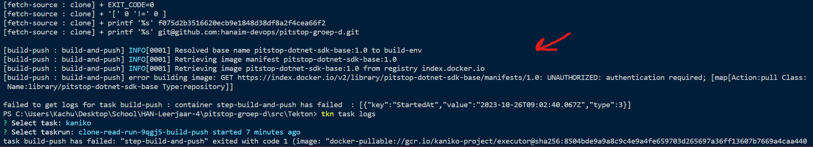

# Kubernetes pipelines met Tekton

## Status

Proposed

## Context

Er is een poging gedaan om [Tekton](https://github.com/hanaim-devops/blog-kachung-tekton) te implementeren in Kubernetes dat een onderzoeksonderwerp is binnen de Devops minor. Met Tekton is het mogelijk om pipelines te gebruiken in Kubernetes. Het idee hierbij is om met [triggers](https://tekton.dev/docs/triggers/) de docker image van het loyaliteitssysteem te bouwen en te pushen naar de Docker registry met [Kaniko](https://hub.tekton.dev/tekton/task/kaniko) als er een event van git plaatsvindt. De trigger zou nog geconfigureerd moeten worden zodat het alleen afgaat als er een verandering binnen het loyaliteitssyteem plaatsvindt. Voor deze taken zijn er Git en Docker credentials nodig zodat de pipeline de gegevens van de Git repo

Bij een CI/CD zoals Gitlab of Github Actions zit de pipeline standaard in de git repository ingebouwd. Voor Gitlab moet er specifiek een omgeving staan waar de Runner in kan draaien. Met Tekton kunnen we de repository pullen en opslaan binnen een [workspace](https://tekton.dev/docs/pipelines/workspaces/). Zo kunnen andere taken gebruik maken van de opgehaalde Git repository. Hierbij is er gebruik gemaakt van SSH credentials om te kijken hoe [Kubernetes Secrets](https://kubernetes.io/docs/concepts/configuration/secret/#ssh-authentication-secrets) in elkaar zit, en een [git-clone task](https://hub.tekton.dev/tekton/task/git-clone) die van tevoren gemaakt is.

Het configureren van Git en Docker credentials heeft veel tijd gekost, waarvan de Docker credentials waarschijnlijk gelukt is. De foutmelding geeft dit niet helemaal helder terug.

Hierdoor is het niet mogelijk om een image te bouwen en  Doordat we niet veel meer tijd hebben, is het verder niet waard om uit te zoeken waarom het niet werkt.

**Update: mogelijke oplossing gevonden door gebruik te maken van Github registry om alle containers van pitstop daarin te zetten, zodat de pipeline daar toegang op heeft.**

## Decision

Schrappen van Tekton CI/CD voor het pitstop project wegens beperkte tijd.

## Consequences

Waarschijnlijk moeten we na elke verandering binnen het loyaliteitsysteem de Docker image elke keer pushen naar de Docker registry, tenzij er met lokale images wordt gewerkt. Al een poging gedaan om een pipeline op te zetten met Github Actions, maar zelfde probleem gevonden dat de pitstop image niet gepulled kan worden van de registry. Nog kijken of het pullen met Tekton mogelijk is door gebruik van Github registry.
